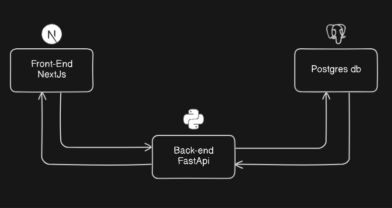

# Qr-code-generator

## Description

<a href="https://github.com/rishabkumar7/devops-qr-code">based on devops-qr-code</a>

A containerized app that generates QR codes with urls as an input :

    - Front-End built with NextJs
    - Api built with python FastApi
    - Data Base built with postgres

The user enters a url and click the button to send the url to the api ,the api checks if the url is present in the data-base or not :

    - if yes it retrieves the corresponding qr-code and sends it back to the user
    - if not it generates a qr-code sends it back to the user and save it in the data-base
    
Build and pushed images to docker hub using jenkins :

    - hamdiz0/qr-front
    - hamdiz0/qr-api
    - hamdiz0/qr-api

## Runing the app

Docker and docker compose must installed :
    - docker compose up
    - docker compose up -f ./docker-compose-images

