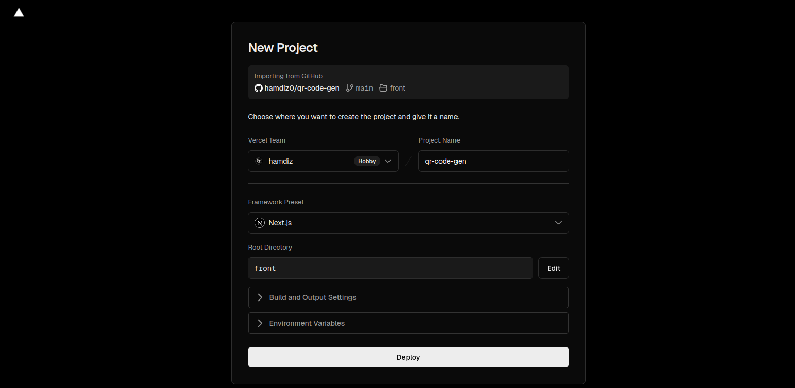
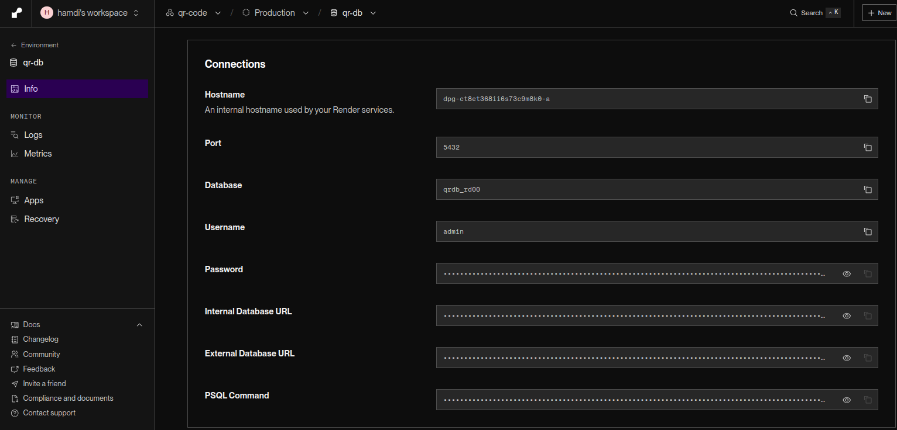
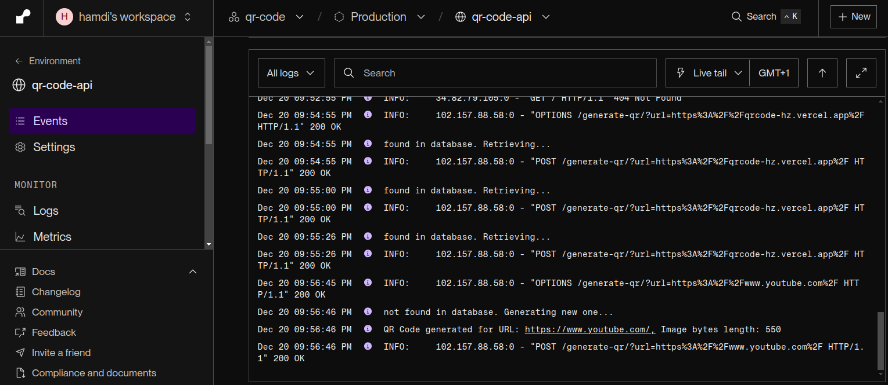

# Qr-Code-Generator

Based on <a href='https://github.com/rishabkumar7/devops-qr-code'>devops-qr-code</a>

A containerized app that generates QR codes with urls as an input 

* Front-End built with NextJs
* Api built with python FastApi
* Data Base created with postgres

The user enters a url and click the button to send the url to the api ,the api checks if the url is present in the data-base or not :

* if yes it retrieves the corresponding qr-code and sends it back to the user
* if not it generates a qr-code sends it back to the user and save it in the data-base


## `Containerizing the app` :

* building and pushing both the front and api images to docker hub using <a href="./jenkinsfile">JenkinsFile</a> 
* utilized a <a href="./script.groovy">Function</a> template to build and push the images 
  - hamdiz0/qr-front:latest
  - hamdiz0/qr-api:latest
  - postgres:15-alpine (default)


 ## `Runing the app using docker-compose` :

* using the Docker files <a href="./docker-compose.yml">view file here</a> :
  - docker compose up --build
* using the docker images from DockerHub <a href="./docker-compose-images.yml">view file here</a> :
  - docker compose up -f ./docker-compose-images.yml up

## `Deploying the app using render and vercel` :

### `deploying the front end on vercel` :

* create a new project on vercel and link the gitub repo hosting the front end
* choose the right directory containing the front end files
* make sure to select the NextJs framework



### `deploying both the api and postgres db on render` :


#### `Setting a Postgres data base` :

* create a new webservice
* make sure to select the nearest region 
* add all the needed information


#### `Setting up the API` :

* create a new webservice
* make sure to select the nearest region 
* select python as the language


* add the Start command :
    ```
    uvicorn main:app --host  0.0.0.0 --port 80
    ```
* add the environment variables along with their values from the postgres service
    ```
    CORS_ORIGIN         // "*" to allow all traffic or set a specific url
    POSTGRES_HOST       // Hostname value from info/connections
    POSTGRES_DB         // Database value from info/connections
    POSTGRES_USER       // Username value from info/connections
    POSTGRES_PASSWORD   // Password value from info/connections
    ```


* the required values are present in the connections part of the postgres db info tab



#### `Results` :




## Checkout my <a href="https://github.com/hamdiz0/LearningDevOps">LearningDevops</a> repo for more details about these tools and devops in general do not hesitate to contribute