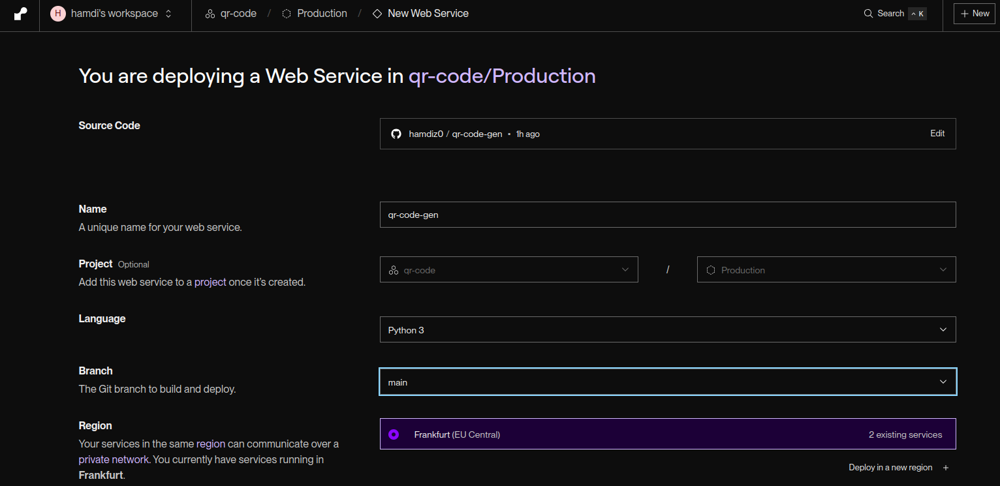
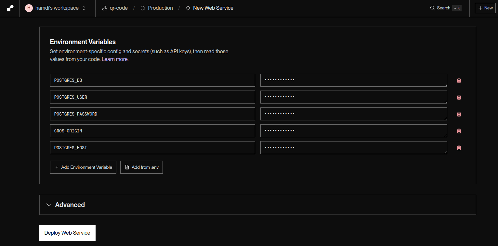
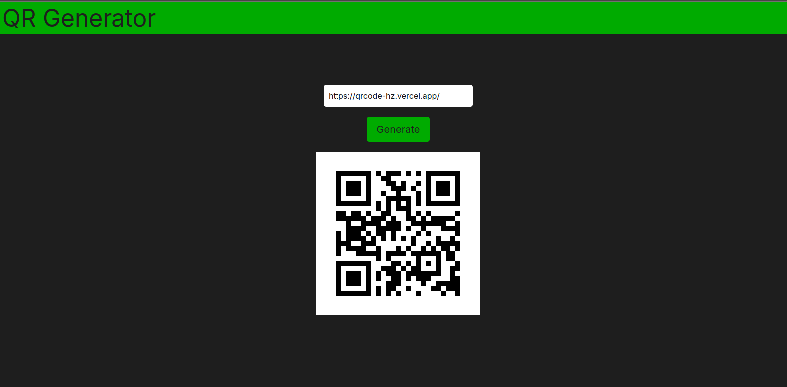

# Qr-Code-Generator

Based on <a href='https://github.com/rishabkumar7/devops-qr-code'>devops-qr-code</a>

This app generates QR codes based on input URLs. 
It is designed to be flexible, working seamlessly in both internal environments like Kubernetes and external deployments on platforms like Vercel and Render by using NextJS routing features along with environment variables to switch between the two modes

- [Prerequisites](#prerequisites-)
- [Running the app using docker-compose](#running-the-app-using-docker-compose-)
- [Deploying an EKS cluster using Terraform](#deploying-an-eks-cluster-using-terraform-)
- [Setting up Jenkins](#setting-up-jenkins-)
- [YAML files](#yaml-files-)
- [CI/CD Pipeline](#cicd-pipeline-)
  - [CI Pipeline](#ci-pipeline-)
    - [Building and Pushing the images](#building-and-pushing-the-images-)
    - [Changing the YAML files image version](#changing-the-yaml-files-image-version-)
    - [Pushing the version change](#pushing-the-version-change-)
  - [CD Pipeline](#cd-pipeline-)
- [Deploying the app using render and vercel](#deploying-the-app-using-render-and-vercel-)
  - [Deploying the front end on vercel](#deploying-the-front-end-on-vercel-)
  - [Deploying both the api and postgres db on render](#deploying-both-the-api-and-postgres-db-on-render-)
    - [Setting a Postgres data base](#setting-a-postgres-data-base-)
    - [Setting up the API](#setting-up-the-api-)
- [Results](#results-)
  - [EKS deployment](#eks-deployment-)
  - [Vercel and Render deployment](#vercel-and-render-deployment-)

* Front-End built with NextJs
* Api built with python FastApi
* Data Base created with postgres

The user enters a url and clicks the button to send the url to the api ,the api checks if the url is present in the data-base or not :

* if yes it retrieves the corresponding qr-code and sends it back to the user
* if not it generates a qr-code sends it back to the user and save it in the data-base


## `Prerequisites` :

* Docker
* Docker-compose
* AWS account (Free Tier)
* Jenkins (as a container)
* AWS-CLI
* Kubectl
* Terraform

 ## `Runing the app using docker-compose` :

* make sure to set up the right enviroment variables in the <a href="./front/.env">.env</a> file for the internal docker compose environmnet
  ```
  NEXT_PUBLIC_USE_INTERNAL_ROUTE=true
  NEXT_PUBLIC_INTERNAL_API=http://api ("api" is the service name for the api in the docker-compose.yml)
  ```

* the external network can be used but it's not practicle for this case 
  ```
  NEXT_PUBLIC_USE_INTERNAL_ROUTE=false
  NEXT_PUBLIC_EXTERNAL_API=http://localhost:3001 (the api service must be forwarded for this to work)
  ```

* run the app using the Docker files in build/context folders <a href="./docker-compose.yml">view file here</a> :
  ```
  docker compose up --build
  ```

* run the app using the docker images from DockerHub <a href="./docker-compose-images.yml">view file here</a> :
  ```
  docker compose up -f ./docker-compose-images.yml up
  ```

## `Deploying an EKS cluster using Terraform` :

* here is a quick setup guide on how to deploy an minimal EKS cluster using terraform :

  - <a href="https://github.com/hamdiz0/eks-terraform-setup">view the guide here</a>

* after creating the cluter make sure to add an access entry for the IAM user to access the cluster
* go to the eks console `EKS>Cluster>"eks-cluster-name">IAM access entries ` and add the user to the cluster with the necessary permissions :

    
  
* The Terraform configuration is divided into three files:
  - <a href="./terraform/eks.tf">eks.tf</a>: Contains the main configuration for the EKS cluster.
  - <a href="./terraform/network.tf">network.tf</a>: Defines the network settings for the EKS cluster.
  - <a href="./terraform/provider.tf">provider.tf</a>: Specifies the provider configuration for AWS.

## `Setting up Jenkins` :

* follow this guide to set up jenkins as a container <a href="https://github.com/hamdiz0/LearningDevOps/blob/main/jenkins/README.md#doker-in-jenkins">Docker in Jenkins</a>

* make sure docker is setup in jenkins (more details <a href="https://github.com/hamdiz0/Learning-DevOps/tree/main/jenkins#doker-in-jenkins">here</a>)

* it's preferable to use a multibranch pipeline cause of the usefull plugins and features it provides

* add "Multibranch Scan Webhook Trigger" plugin in jenkins 


* configure a webhook in the git repo webhook settings :
    - `<jenkins-url>/multibranch-webhook-trigger/invoke?token=<token>`

* more details about multibranch webhooks <a href="https://github.com/hamdiz0/Learning-DevOps/blob/main/jenkins/README.md#multibranch-triggers-">here</a>

* install the aws cli in the jenkins container :
    ```sh
    docker exec -it jenkins bash
    ```
    ```sh
    apt install unzip wget
    wget "https://awscli.amazonaws.com/awscli-exe-linux-x86_64.zip"
    unzip awscli-exe-linux-x86_64.zip
    sudo ./aws/install
    ```
* configure the aws cli with the credentails of the IAM user used to cretae the EKS cluster or add a new user for jenkins with right permissions :
    ```sh
    aws configure
    ```
* verify the configuration :
    ```sh
    aws sts get-caller-identity
    ```
* install kubectl in the jenkins container :
    ```sh
    K8S_VERSION=1.32
    apt-get update
    apt-get install --quiet --yes apt-transport-https ca-certificates curl
    curl -fsSL https://pkgs.k8s.io/core:/stable:/v${K8S_VERSION}/deb/Release.key | \
    gpg --dearmor -o /etc/apt/keyrings/kubernetes-apt-keyring.gpg
    echo "deb [signed-by=/etc/apt/keyrings/kubernetes-apt-keyring.gpg] https://pkgs.k8s.io/core:/stable:/v${K8S_VERSION}/deb/ /" | \
    tee /etc/apt/sources.list.d/kubernetes.list
    apt-get update
    apt-get install --quiet --yes kubectl
    ```
* update the kubeconfig file :

  ```sh
  aws eks --region <region> update-kubeconfig --name <cluster-name>
  ```

## `YAML files` :

* set up a deployment with its corresponding service for each component of the app
  - <a href="./k8s-manifests/front-deployment_svc.yml">front-end</a> - (LoadBalancer)
  - <a href="./k8s-manifests/api-deployment_svc.yml">api</a> - (ClusterIP)
  - <a href="./k8s-manifests/postgres-deployment_svc.yml">postgres</a> - (ClusterIP)

## `CI/CD Pipeline` :

### `CI Pipeline` :

#### `Building and Pushing the images` :

* utilized two <a href="./script.groovy">Function Templates</a>  to build and push the images 
  - hamdiz0/qr-front:latest
  - hamdiz0/qr-api:latest
  - postgres:15-alpine (default)


#### Changing the YAML files iamge verion :

* utilized a script to change the demployment image version <a href="./k8s-manifests/change_version.sh">change_version.sh</a>
* in the `update version` stage, Jenkins runs the script to change both the front-end and api image versions 
    ```groovy
    script {
      sh """
        cd k8s-manifests
        chmod +x change_version.sh
        ./change_version.sh -v $VERSION
      """
    }
    ```
### Pushing the version change :

* set up jenkins to update the git repository with new version
* set up a git `user.name` and `user.eamil` for Jenkins :
    ```
    docker exec -it jenkins bash
    git config --global user.name "jenkins"
    git config user.email "jenkins@jenkins.com"
    ```
* ustilized a function that adds and pushs changes to a git repository 
    - view the function <a href="./script.groovy">here</a>
* the function uses a git access token wish must be configured and added to jenkins as a `Username and Password` credential
  - set up an access token in git hub :
    
* make sure to add the `Ignore Commiter Strategy` plugin and ignore jenkins pushes to avoid infinite build loops :
      
* example of using the function :
    ```groovy
    gs.git_push(
        'github.com/hamdiz0/qr-code-generator',     // url without "https://"
        'github-api-token',                         // credentialsId
        "updated to version ${VERSION}",            // commit message
        'main'                                      // branch
    )
    ```

### `CD Pipeline` :

* after the `updated version` stage the `deploy` stage is triggered 
* the `deploy` stage runs the <a href="./k8s-manifests/deploy.sh">deploy.sh</a> script wich applies the changes to the `EKS` cluster :
    ```groovy
    script {
      sh """
          export KUBECONFIG=$KUBECONFIG  // eks kubeconfig's absolute path in the jenkins container
          cd k8s-manifests               // change directory to the yaml files directory
          chmod +x deploy.sh             // make the script executable
          ./deploy.sh                    // run the script
      """
    }
    ```
* the yaml files must be in the same directory as the script


## `Deploying the app using render and vercel` :

### `deploying the front end on vercel` :

* create a new project on vercel and link the gitub repo hosting the front end
* choose the right directory containing the front end files
* make sure to select the NextJs framework

  

* add the necessary environment variables for the external routing mode in `Settings/Environment Varaibles`
  ```
  NEXT_PUBLIC_USE_INTERNAL_ROUTE=true
  NEXT_PUBLIC_EXTERNAL_API=an external api url "https://api.onrender.com"
  ```

  

### `deploying both the api and postgres db on render` :


#### `Setting a Postgres data base` :

* create a new webservice
* make sure to select the nearest region 
* add all the needed information


#### `Setting up the API` :

* create a new webservice
* make sure to select the nearest region 
* select python as the language



* add the Start command :
    ```
    uvicorn main:app --host  0.0.0.0 --port 80
    ```
* add the environment variables along with their values from the postgres service
    ```
    CORS_ORIGIN         // "*" to allow all traffic or set a specific url
    POSTGRES_HOST       // Hostname value from info/connections
    POSTGRES_DB         // Database value from info/connections
    POSTGRES_USER       // Username value from info/connections
    POSTGRES_PASSWORD   // Password value from info/connections
    ```


* the required values are present in the connections part of the postgres db info tab


## `Results` :

### `EKS deployment` :


### `Vercel and Render deployment` :




## Checkout my <a href="https://github.com/hamdiz0/LearningDevOps">LearningDevops</a> repo for more details about these tools and devops in general do not hesitate to contribute